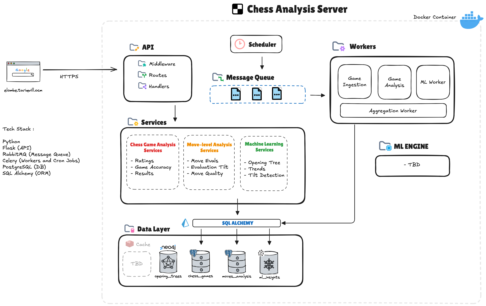

# Elombé

> _/e-LOM-bay/_  
> **Adjective** (Lingala — spoken in the Democratic Republic of Congo)  
> **Meaning**: *Brave one*, *Giant*, *One who stands tall* , *Winner*

---

# Why "Elombé"?

In chess, **"Elo"** is the number you carry into every game , a quiet measure of your strength, growth, and experience. But using Elo as your only metric is like reading the sheet music and thinking you’ve heard the symphony. It misses the passion, the tempo, the soul of the performance.

That’s where **Elombé** comes in , she's my attempt to hear the music

She is a private chess server , built not just to analyze moves, but to help me see myself more clearly through the games I play. And yes, I said *she*. I've started naming my servers because if you think about it, they kinda deserve it

Elombé is up 24/7. She hums along on a humble $8 VPS with just 1GB of RAM. She never crashes under pressure (unless I forget an indent). Honestly, she handles stress better than most people I know

The name itself came from **"Olembe"**, which I first heard in one of my favorite songs , *Legolas* by **Odumodu Blvck**, where he says:

> "_But when in Cameroon, my babies call me Big Olembe_"

I looked it up and found "Elombé," which means brave one or giant. It felt right. If I’m going to build something that watches my every blunder and still doesn’t flinch at the challenge of helping me grow, she deserves a name worthy of that energy

---

## 🧠 What She Does

Elombé helps me:

- Track my accuracy and performance over time
- Analyze my openings, mistakes, and tactical strengths
- Visualize trends in my ratings, streaks, and time management
- Curate and annotate my most memorable games
- Reflect on how I win, lose, and grow as a player

---

## 🏗️ System Architecture

### Architecture Overview

Elombé is designed for scalable, asynchronous chess analysis. The architecture separates fast, read-only API queries from heavy analysis jobs, ensuring responsiveness and reliability.

- **API Layer**: Built with Python and Flask, the API is mostly read-only. It serves preprocessed results to the frontend by querying the database and cache. The API does not directly enqueue jobs in the current phase.
- **Async Pipeline**: Expensive or long-running tasks (game ingestion, move analysis, ML jobs) are handled asynchronously. A scheduler (Celery Beat) periodically enqueues tasks into RabbitMQ, which are then processed by Celery workers. Results are stored in the database for later retrieval.
- **Message Queue**: RabbitMQ acts as the backbone for asynchronous communication between the scheduler and workers.
- **Workers**: Celery workers perform game ingestion, analysis, and future ML tasks. An aggregation worker combines results as needed.
- **Data Layer**: PostgreSQL (with SQLAlchemy ORM) stores chess games, analysis results, and insights. Caching and graph DBs (e.g., Neo4j) are planned for specialized queries and visualizations. The graph DB will power:
  - **Game Tree Visualization**: Interactive diagrams of move sequences and branching paths.
  - **Opening Variation Tree**: Color-coded trees showing opening lines and results.
  - **Tree Diagrams**: Rich, navigable representations of chess positions and outcomes.
- **ML Engine**: Future extension for advanced analysis, trends, and tilt detection.

#### Data Flow
1. **Async Pipeline**: Scheduler → Message Queue → Workers → Database
2. **Sync Read Path**: API → Services → Database

> The API currently only reads from the database and cache, serving frontend requests. In future phases, the API may also enqueue jobs (e.g., "reanalyze this game now").
